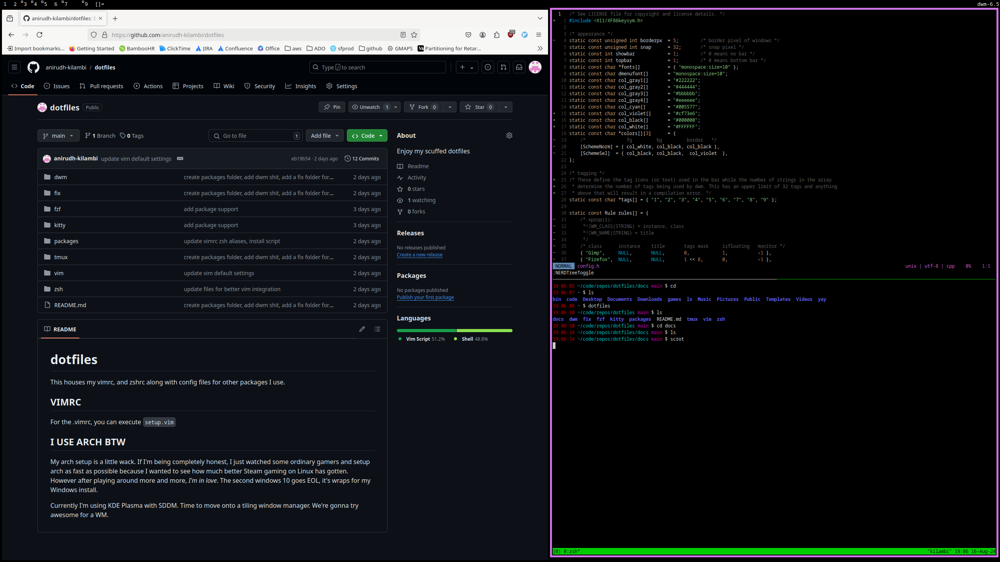

# dotfiles

This houses my vimrc, and zshrc along with config files for other packages I use.

## VIMRC
For the .vimrc, you can execute `setup.vim`

## FIXES
### Fuzzy looking suckless text
If you install DWM, start your xserver, and think that things look really fuzzy. Specifically with respect to the terminal, `st`, and the default `dwm`
text, that's because xorg doesn't know what fonts to use. Take a look at the xorg logs:
` grep /fonts ~/.local/share/xorg/Xorg.0.log`
You might see "folder not found" with respect to fonts. If that's the case, take a look and make sure you got some fonts:

`fc-list ':' file`

Update your `.xinitrc` with the following line:

`xset + fp /usr/share/fonts/local/ &`

Reload your xorg server and should be resolved.

### Getting multimedia keys set up
To determine what the multimedia keybind is, you can click your multimedia key after running `xbindkeys --keys`

`xbindkeys --keys {press multimedia key}`

That will tell you which keypress it is. For my case, with the Chalice40, I have it set up under `fix/get_working_multimedia_keys/xbindkeysrc`.
Copy that to `~/.xbindkeysrc` and should be good. To ensure it starts up with your xorg server add this:

`xbindkeys &`

to your `.xinitrc`.

### Disable Mouse Acceleration
To disable mouse accel permanently, copy `fix/disable_mouse_accel/40-libinput.conf` to `/etc/X11/xorg.conf.d/`.

For a one time mouse accel disable:

1. Determine input ID for your desired pointer object.
2. `xinput set-prop "{input ID}" "libinput Accel Profile Enabled" 0 1 0`
3. Profit

## I USE ARCH BTW

My arch setup is a little wack. If I'm being completely honest, I just watched
some ordinary gamers and setup arch as fast as possible because I wanted to see
how much better Steam gaming on Linux has gotten. However after playing around more and more,
*I'm in love*. The second windows 10 goes EOL, it's wraps for my Windows install.

Currently I'm using KDE Plasma with SDDM. Time to move onto a tiling window manager.
We're gonna try awesome for a WM.

### 08/16/24 UPDATE
ran `sudo pacman -Rcns` on sddm and plasma. Losing SDDM was frankly whatever. I don't really care about having a fancy looking login page.
Losing kde-plasma was quite painful, I kinda forgot how much just running `sudo pacman -Sy plasma` does in terms of setup. Audio drivers, network drivers,
it's crazy. That being said I have come out of it stronger. We're using a simple `pulseaudio` setup with pulseaudio and `pulseaudio-ctl` to handle that.

I've also moved to DWM as a tiling window manager. I didn't even bother trying out awesome wm tbh. I really liked how simple DWM is. 
It really is no frills (funny moment for all my Canadian friends) out of the box. One of my biggest fears is installing stuff that I don't need.
Which is why you can now see under `packages/install.sh`. That is meant to exist as a running tab of all the packages I've installed (outside of installation).
The hope being to avoid any bloat in my load. I have a very barebones dwm setup, I just tried to tie it together with the changes I made to my vim setup.
Realistically need to update the tab bar with some nice to have information (datetime is the only thing I *really* want. The rest I don't really care about).

